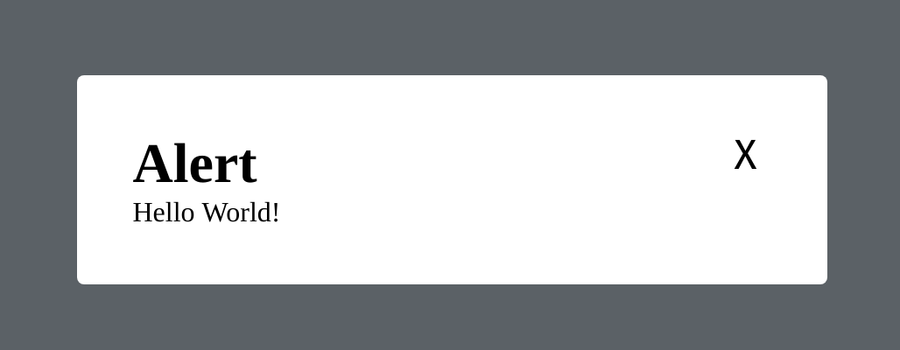

![Built With Stencil](https://img.shields.io/badge/-Built%20With%20Stencil-16161d.svg?logo=data%3Aimage%2Fsvg%2Bxml%3Bbase64%2CPD94bWwgdmVyc2lvbj0iMS4wIiBlbmNvZGluZz0idXRmLTgiPz4KPCEtLSBHZW5lcmF0b3I6IEFkb2JlIElsbHVzdHJhdG9yIDE5LjIuMSwgU1ZHIEV4cG9ydCBQbHVnLUluIC4gU1ZHIFZlcnNpb246IDYuMDAgQnVpbGQgMCkgIC0tPgo8c3ZnIHZlcnNpb249IjEuMSIgaWQ9IkxheWVyXzEiIHhtbG5zPSJodHRwOi8vd3d3LnczLm9yZy8yMDAwL3N2ZyIgeG1sbnM6eGxpbms9Imh0dHA6Ly93d3cudzMub3JnLzE5OTkveGxpbmsiIHg9IjBweCIgeT0iMHB4IgoJIHZpZXdCb3g9IjAgMCA1MTIgNTEyIiBzdHlsZT0iZW5hYmxlLWJhY2tncm91bmQ6bmV3IDAgMCA1MTIgNTEyOyIgeG1sOnNwYWNlPSJwcmVzZXJ2ZSI%2BCjxzdHlsZSB0eXBlPSJ0ZXh0L2NzcyI%2BCgkuc3Qwe2ZpbGw6I0ZGRkZGRjt9Cjwvc3R5bGU%2BCjxwYXRoIGNsYXNzPSJzdDAiIGQ9Ik00MjQuNywzNzMuOWMwLDM3LjYtNTUuMSw2OC42LTkyLjcsNjguNkgxODAuNGMtMzcuOSwwLTkyLjctMzAuNy05Mi43LTY4LjZ2LTMuNmgzMzYuOVYzNzMuOXoiLz4KPHBhdGggY2xhc3M9InN0MCIgZD0iTTQyNC43LDI5Mi4xSDE4MC40Yy0zNy42LDAtOTIuNy0zMS05Mi43LTY4LjZ2LTMuNkgzMzJjMzcuNiwwLDkyLjcsMzEsOTIuNyw2OC42VjI5Mi4xeiIvPgo8cGF0aCBjbGFzcz0ic3QwIiBkPSJNNDI0LjcsMTQxLjdIODcuN3YtMy42YzAtMzcuNiw1NC44LTY4LjYsOTIuNy02OC42SDMzMmMzNy45LDAsOTIuNywzMC43LDkyLjcsNjguNlYxNDEuN3oiLz4KPC9zdmc%2BCg%3D%3D&colorA=16161d&style=flat-square)

# ez-modal
This is a native web component that builds a simple modal for use in a project.

This modal aims to be responsive and simple to use.  It has a light transition in and out to create a nice user experience.

This element does not use Shadow-Dom which should allow a user to customize the styles of the component by using custom stylesheets, however this component is not intended to be modified.  If you do seriously want to change it, I recomend forking the project and altering the component to fit your needs.



## Installing
Installing this app can be done a few ways.

### Quickstart
Add this script to your head tag.
```javascript
<script src="https://unpkg.com/ez-modal@0.0.7/dist/ez-modal.js"></script>
```

### NPM
Install the package using npm or yarn.

npm:

```bash
npm i --save ez-modal
```

yarn:

```bash
yarn add ez-modal
```

Including these tags in your project.
```javascript
import my-component;
```

If you need to integrate this into another framework like React or angular be sure to check out the [Stencil page for integration](https://stenciljs.com/docs/overview).

## Getting started
The basic usage of this modal is below.
```html
<ez-modal is-open>
  <h1 slot="title"><!--Optional-->
    Alert
  </h1>
  Hello World!
</ez-modal>
```


## Using JavaScript with our modal
This modal is a real HTML element so you can do select it like a real element.
```html
<ez-modal>
  <h1 slot="title"><!--Optional-->
    Alert
  </h1>
  Hello World!
</ez-modal>
<script>
  var modal = document.querySelector('ez-modal');
  modal.isOpen = true; // Will set is-open and open the modal.
  setTimeout(function() {
    modal.isOpen = false;
  }, 3000); // Will close the modal after a few seconds.
</script>
```

## Slots

Ez-modal has 2 slots for the component, title and content.

### Title
In the previous examples you will see the h1 tag with title passed in as slot.
```html
<h1 slot="title">...</h1>
```
This will put content on the top of the modal.  By default this value is `Alert` and can be changed by passing a valid value.

### Content
Any other content that is not inside of the slot title element will be appended into the normal slot.  This content will appear as the body of the modal.  In our example above this is `Hello World!`.

## Detailed Generated Modal Docs
Advanced modal documentation can be found on the [Modal information page](./src/components/readme.md)

## Where does it work?
Right now it works everywhere.
Chrome, Firefox, Edge, Safari, and IE.  We do not indend to support IE long term because we don't believe IE should still be in use.  The fact that it works in IE is nice, but not something we aimed to do on purpose.

## Working on this project 
This repository comes with a working demo version of this component.  In order to run this demo run the following commands.

```bash
npm install
npm start
```
